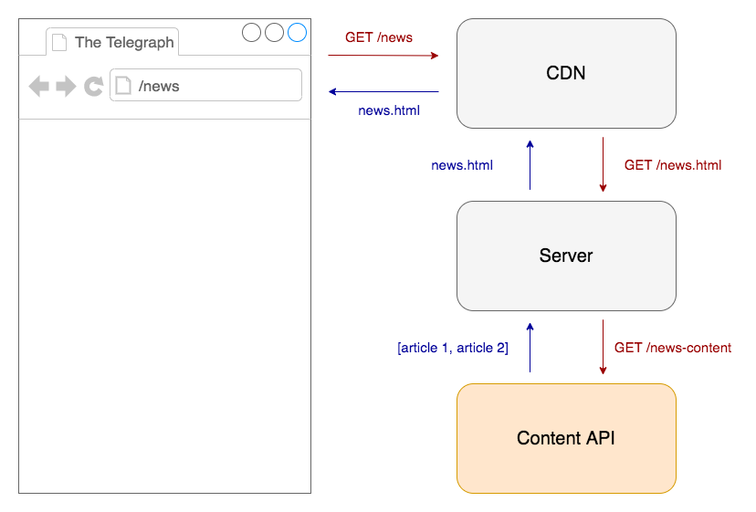

# Express

## Introduction

This POC will explore a server-side rendered application using [Express](https://expressjs.com/), which is a popular web application framework for [Node.js](https://nodejs.org/en/), combined with [express-handlebars](https://www.npmjs.com/package/express-handlebars) as a templating language.
The front-end will use vanilla CSS and JavaScript.

## Objectives

Explore server-side rendering using Express. I will predominantly be looking at:

- Scalability
- Maintainability
- Performance
- Configurability

## POC

- Project repo: [https://github.com/chrisboakes/express-demo](https://github.com/chrisboakes/express-demo)
- Built project: [https://express-demo-poc.herokuapp.com/](https://express-demo-poc.herokuapp.com/)

The application uses these mock API calls:

- [List](https://my-json-server.typicode.com/chrisboakes/express-demo/articles)
- [Article](https://my-json-server.typicode.com/chrisboakes/express-demo/coronavirus-q&a-how-will-businesses-cope)

It use Express for:

- [Routing](https://expressjs.com/en/guide/routing.html)
- [Middleware](https://expressjs.com/en/guide/using-middleware.html)

The Politics and News pages use middleware to filter out the data from the list. In a real world scenario you would fetch this data pre-filtered from an API, however I wanted something simple to demonstrate middleware so I used it to do this.

The front-end uses vanilla JavaScript and modern CSS (combined and prefixed using PostCSS)

## Outcome

### Pros

- Express is the most popular Node.js framework and is widely adopted by companies like Uber and IBM
- Written in JavaScript, a hugely popular programming language
- Performant - can configure to only use what you need
- Can be combined with multiple view engines, allowing the use of templates, partials, components etc.

### Cons

- Doesn't leverage state management techniques made popular by front-end frameworks
- Requires architecture to establish scability best practices
- Developer experience - no abstraction away from JavaScript. Requires a JavaScript pattern.

## Resources

- [Express Docs](https://expressjs.com/)
- [Express Handlebars](https://github.com/ericf/express-handlebars)
- [PostCSS](https://postcss.org/)

## Rendering

Most content should be served through a CDN with a reasonable [TTL](https://www.imperva.com/learn/performance/time-to-live-ttl/). For cached content:


For stale content:



## Running the project

```bash
# Install dependencies
$ npm install

# Run development mode
$ npm run dev

# Watchers for FE code
$ npm run watch

# Production build
$ npm run build
```

